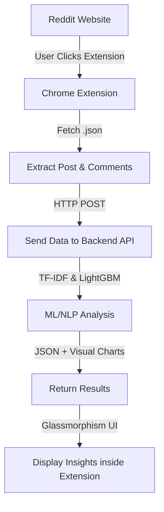

# Reddit Response Analysis: End-to-End ML Pipeline & Chrome Extension

This project is a complete, full-stack Machine Learning application designed to perform real-time response analysis (sentiment analysis) on Reddit comments. It consists of a robust ML pipeline managed by DVC, an MLflow tracking server, a Flask API backend, and a dynamic Chrome Extension featuring a modern Glassmorphism UI.

---

## 🏗️ Complete Project Workflow

The project was built using the following end-to-end lifecycle:

1. **Data Collection**: Scraping and aggregating raw comment data.
2. **Data Preprocessing & EDA**: Cleaning text (removing stopwords, lemmatization) and performing Exploratory Data Analysis.
3. **Building Baseline Model**: Establishing initial accuracy metrics with a simple model.
4. **Setup MLflow Server on AWS**: Configuring a remote server for experiment tracking and model versioning.
5. **Improve Baseline Model**: Experimenting with BOW, TF-IDF, Max Features, handling imbalanced data, and performing Hyperparameter Tuning across multiple ML models (LightGBM, XGBoost).
6. **Build ML Pipeline using DVC**: Automating the data processing, model building, and evaluation stages via Data Version Control.
7. **Add Model to Model Registry**: Versioning the best-performing LightGBM model and TF-IDF vectorizer via MLflow.
8. **Implement Chrome Plugin**: Developing a browser extension to fetch Reddit `.json` data without API keys and interact with the backend.
9. **CI/CD Workflow**: Setting up continuous integration and deployment pipelines using GitHub Actions.
10. **Deployment**: Deploying the final Flask backend API to an AWS instance.

---

## 🔄 Application Architecture Flow

When a user interacts with the Chrome Extension on a Reddit post, the following sequence occurs:



---

## ⚙️ Setup Instructions

### 1. Environment Setup
Create an isolated Conda environment and install dependencies:
```bash
conda create -n reddit python=3.11 -y
conda activate reddit
pip install -r requirements.txt
```

### 2. DVC Pipeline
The project's ML pipeline is managed via DVC. To execute the pipeline:
```bash
dvc init
dvc repro
dvc dag
```

---

## 🚀 Running the Application

### Local API Server
Start the Flask backend to serve predictions and generate visualization charts for the Chrome extension:
```bash
python reddit_api.py
```
> **Note**: The backend runs on port `8080` by default (`http://localhost:8080/`).

### Chrome Extension Setup
1. Open Google Chrome and navigate to `chrome://extensions`.
2. Enable **Developer mode** using the toggle in the top right corner.
3. Click **Load unpacked** and select the `reddit-chrome-plugin-frontend` directory.
4. Navigate to any Reddit post (e.g., `https://www.reddit.com/r/.../comments/...`).
5. Click the "Reddit Response Insights" extension icon in your browser toolbar to view the dynamic sentiment charts, response trends, and top comments.

---

## 🧪 API Usage Example

You can manually test the prediction endpoint locally via tools like Postman or `curl`:

```http
POST http://localhost:8080/predict_with_timestamps
Content-Type: application/json

{
    "comments": [
        {"text": "This is an amazing and insightful post!", "timestamp": "2023-10-01T12:00:00Z", "authorId": "user1"},
        {"text": "Terrible explanation, very hard to understand.", "timestamp": "2023-10-01T12:05:00Z", "authorId": "user2"}
    ]
}
```
